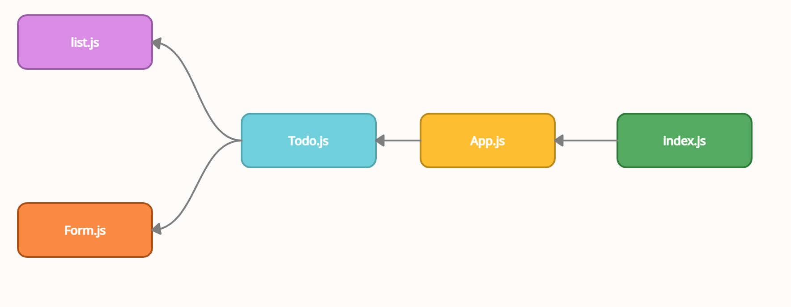
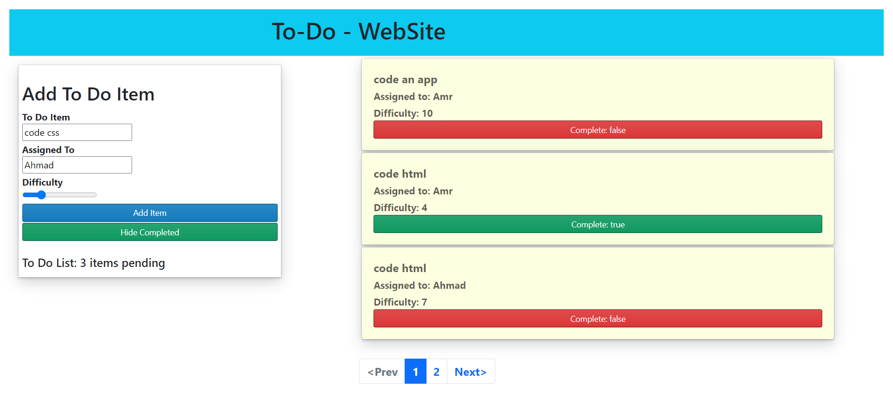
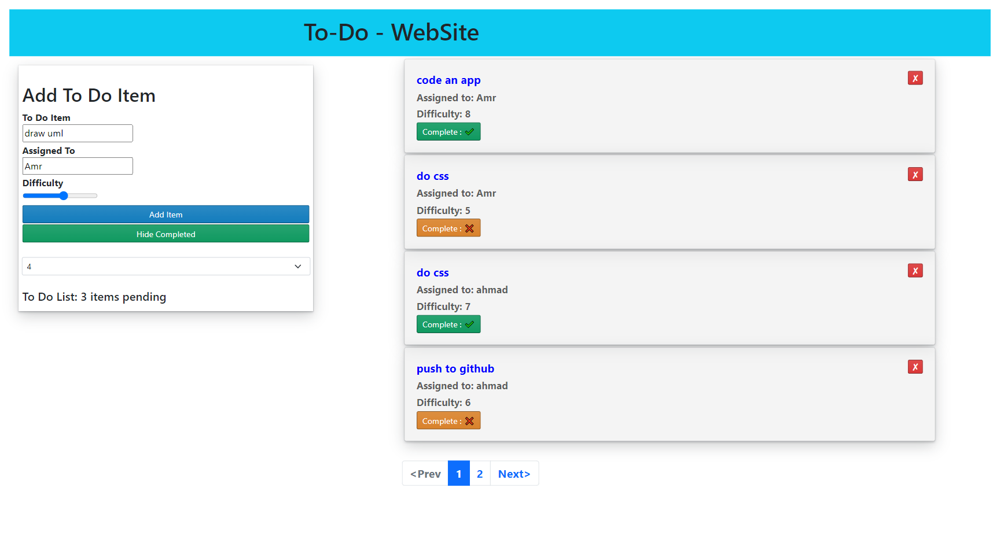

# Author: Amr Nzzal 

## Deployed site on Netlify

* [Netlify](https://todo-amr.netlify.app/) .

## Deployed site on Sandbox

* [sandbox](https://codesandbox.io/s/todo-740h4/) .
  
## GitHub repo

* [repo](https://github.com/amr88nzzal/todo-app) .

## PR

* [PR](https://github.com/amr88nzzal/todo-app/pulls)
  
## How to start this app ?

1. clone this repository
2. install all dependencies and packages
   `npm install`
3. run the app
  `npm start`

## UML

## ScreenShot

### Lab31

## Notes:

  - useForm hooks is used to handle the form submission and the input values changes.
  - context api is used in this app tp handle the flow of elements in the list and their show/ hide attributes.

# Phase 2 Requirements

* In Phase 2, we’re going to extend the functionality of our application by allowing the user to make some decisions on how they would like the application to function. Specifically, we’ll let them make changes to 2 settings.

1- Implement the Context API to make some basic application settings available to components

    1- How many To Do Items to show at once

    2- Whether or not to show completed items

2- Provide the users with a form where they can change the values for those settings

    1- This should be given in the form of a new component, perhaps linked to from the main navigation

    2- Hint: Use Browser Router to create the page/route/component for this

3- Save the users choices in Local Storage

4-Retrieve their preferences from Local Storage and apply them to the application on startup

### ScreenShot
