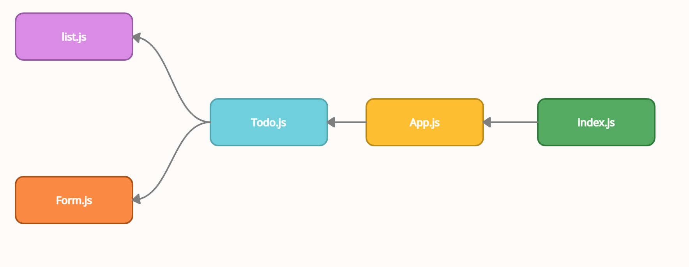
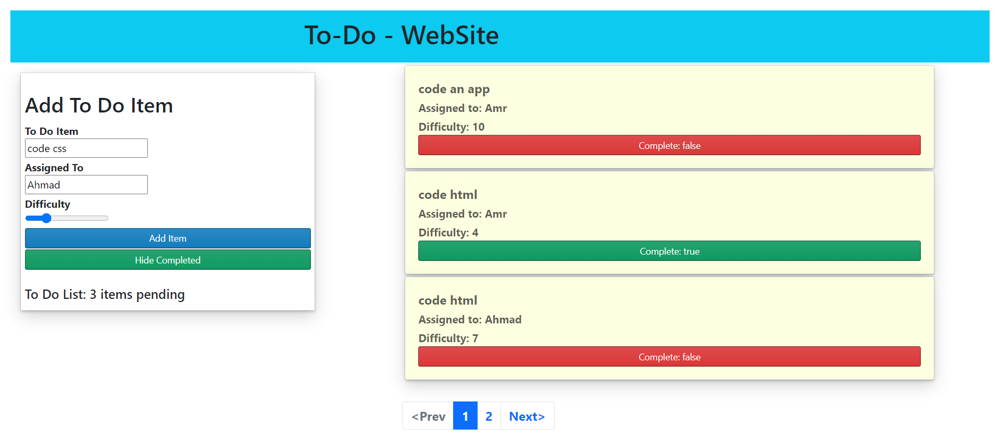

# Author: Amr Nzzal 

## Deployed site on Netlify

* [Netlify](https://todo-amr.netlify.app/) .

## Deployed site on Sandbox

* [sandbox](https://codesandbox.io/s/todo-740h4/) .
  
## GitHub repo

* [repo](https://github.com/amr88nzzal/todo-app) .

## PR

* [PR](https://github.com/amr88nzzal/todo-app/pulls)
  
## How to start this app ?

1. clone this repository
2. install all dependencies and packages
   `npm install`
3. run the app
  `npm start`

## UML

## ScreenShot

## Notes:

  - useForm hooks is used to handle the form submission and the input values changes.
  - context api is used in this app tp handle the flow of elements in the list and their show/ hide attributes.